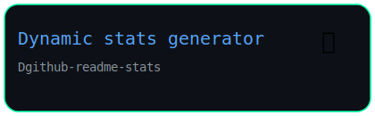

<!-- ===================== -->
<!-- 🔥 HERO -->
<!-- ===================== -->

  <pre align="center">
      ___           ___           ___       ___       ___     
     /\__\         /\  \         /\__\     /\__\     /\  \    
    /:/  /        /::\  \       /:/  /    /:/  /    /::\  \   
   /:/__/        /:/\:\  \     /:/  /    /:/  /    /:/\:\  \  
  /::\  \ ___   /::\~\:\  \   /:/  /    /:/  /    /:/  \:\  \ 
 /:/\:\  /\__\ /:/\:\ \:\__\ /:/__/    /:/__/    /:/__/ \:\__\
 \/__\:\/:/  / \:\~\:\ \/__/ \:\  \    \:\  \    \:\  \ /:/  /
      \::/  /   \:\ \:\__\    \:\  \    \:\  \    \:\  /:/  / 
      /:/  /     \:\ \/__/     \:\  \    \:\  \    \:\/:/  /  
     /:/  /       \:\__\        \:\__\    \:\__\    \::/  /   
     \/__/         \/__/         \/__/     \/__/     \/__/    
</pre>
<h1 align="center"> </h1>

  

<!-- ===================== -->
<!-- 🚀 PROJECTS -->
<!-- ===================== -->

<h2 align="center">Projects</h2>

  
  
  

<!-- ===================== -->
<!-- 🔻 SEPARATOR -->
<!-- ===================== -->
<!-- ===================== -->

  

<!-- ===================== -->
<!-- 🤖 EXTERNAL -->
<!-- ===================== -->

<h2 align="center">External Project</h2>

  
    

<!-- ===================== -->
<!-- 🔻 SEPARATOR -->
<!-- ===================== -->

  

 

<!-- ===================== -->
<!-- 📊 STATS -->
<!-- ===================== -->

<!--  <h2 align="center">📊 Stats</h2> -->

<!-- rząd 1 -->

  
  
  

<!-- rząd 2 -->

    

 

<!-- ===================== -->
<!-- 🧠 TECH STACK -->
<!-- ===================== -->

<!--
 -->

  

  

  

  

  

  

