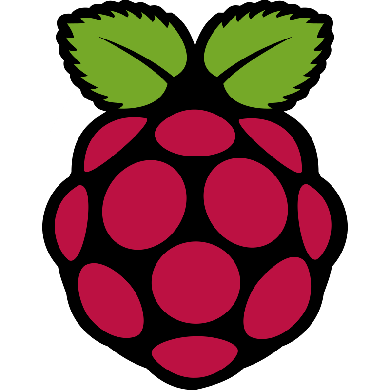
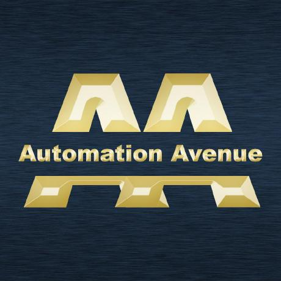

<!-- ===================== -->
<!-- 🔥 HERO -->
<!-- ===================== -->

  <pre align="center">
      ___           ___           ___       ___       ___     
     /\__\         /\  \         /\__\     /\__\     /\  \    
    /:/  /        /::\  \       /:/  /    /:/  /    /::\  \   
   /:/__/        /:/\:\  \     /:/  /    /:/  /    /:/\:\  \  
  /::\  \ ___   /::\~\:\  \   /:/  /    /:/  /    /:/  \:\  \ 
 /:/\:\  /\__\ /:/\:\ \:\__\ /:/__/    /:/__/    /:/__/ \:\__\
 \/__\:\/:/  / \:\~\:\ \/__/ \:\  \    \:\  \    \:\  \ /:/  /
      \::/  /   \:\ \:\__\    \:\  \    \:\  \    \:\  /:/  / 
      /:/  /     \:\ \/__/     \:\  \    \:\  \    \:\/:/  /  
     /:/  /       \:\__\        \:\__\    \:\__\    \::/  /   
     \/__/         \/__/         \/__/     \/__/     \/__/    
</pre>

<h1 align="center"> I'm Markiel
</h1>

  

<!-- ===================== -->
<!-- 🚀 PROJECTS -->
<!-- ===================== -->

<!-- ===================== -->
<!-- rząd I
<!-- ===================== -->

<h2 align="center">Projects</h2>

<table align="center">
<tr>
<td width="33%">

<a href="https://github.com/MarkielPL/AnotherArch-PC" style="text-decoration:none;">

  

    
    

      <strong>AnotherArch-PC</strong> 
      Arch install guide (x86-64)
    

  

</a>

</td>

<td width="33%">

<a href="https://github.com/MarkielPL/ArchArm7v-Rpi3B" style="text-decoration:none;">

  

    
    

      <strong>ArchArm7v-Rpi3B</strong> 
      Arch Linux on Raspberry Pi 3B+
    

  

</a>

</td>

<td width="33%">

<a href="https://github.com/MarkielPL/ConsVita" style="text-decoration:none;">

  

    
    

      <strong>ConsVita</strong> 
      Custom project Flutter/Dart
    

  

</a>

</td>
</tr>
</table>

<!-- ===================== -->
<!-- rząd II
<!-- ===================== -->

<!-- ===================== -->
<!-- 🔻 SEPARATOR -->
<!-- ===================== -->

<!-- ===================== -->
<!-- 🤖 EXTERNAL -->
<!-- ===================== -->

<h2 align="center">External Project</h2>

<table align="center">
<tr>

<td align="center">
<a href="https://github.com/MarkielPL/Tavris1">
 
<b>Tavris1</b> 
ComfyUI workflows
</a>
</td>

<td align="center">
<a href="https://github.com/MarkielPL/github-readme-stats">
 
<b>GitHub Stats</b> 
GitHub Stats
</a>
</td>

<td align="center">
<a href="https://github.com/MarkielPL/proxmox-on-raspberry">
 
<b>Automation Avenue</b> 
PXVIRT Proxmox fork
</a>
</td>

<table align="center">
<tr>

<!-- ===================== -->
<!-- 🔻 SEPARATOR -->
<!-- ===================== -->

  

 

<!-- ===================== -->
<!-- 📊 STATS -->
<!-- ===================== -->

<!--  <h2 align="center">📊 Stats</h2> -->

<!-- rząd 1 -->

  
  
  

<!-- rząd 2 -->

    

 

<!-- ===================== -->
<!-- 🧠 TECH STACK -->
<!-- ===================== -->

<!--
 -->

  

  

  

  

  

  

  
   

