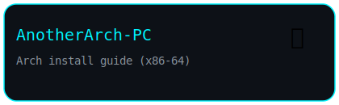
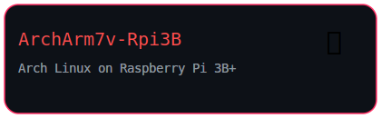
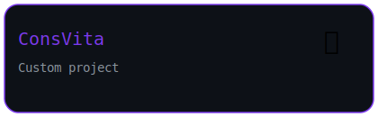
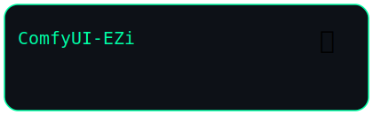

<!-- ===================== -->
<!-- 🔥 HERO -->
<!-- ===================== -->

<h1 align="center">Hi, I'm Markiel 👋</h1>

  

  

<!-- ===================== -->
<!-- 🚀 PROJECTS -->
<!-- ===================== -->

<h2 align="center">Projects</h2>

  
  
  

 

<!-- ===================== -->
<!-- 🔻 SEPARATOR -->
<!-- ===================== -->

  

 

<!-- ===================== -->
<!-- 🤖 EXTERNAL -->
<!-- ===================== -->

<h2 align="center">External Project</h2>

  

 

<!-- ===================== -->
<!-- 🔻 SEPARATOR -->
<!-- ===================== -->

  

 

<!-- ===================== -->
<!-- 📊 STATS -->
<!-- ===================== -->

<h2 align="center">📊 Stats</h2>

<!-- rząd 1 -->

  
  

<!-- rząd 2 -->

  

  

<!-- ===================== -->
<!-- 🧠 TECH STACK -->
<!-- ===================== -->

<h2 align="center">🧠 Tech Stack</h2>

  

